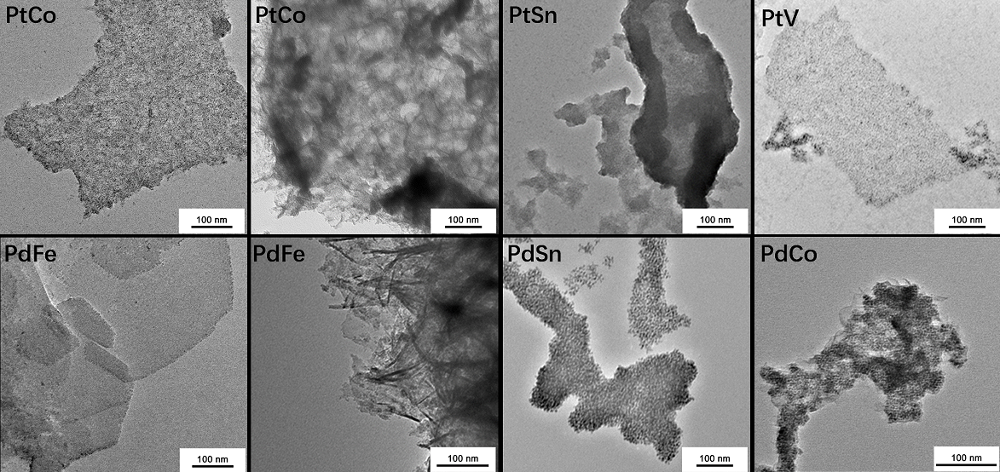

## Research Interests 

**Artificial photosynthesis, Energy Related Nano Materials, Chemistry of Surface and Interface**

## Experience
*I have conducted research in various fields including biosensors, organic total synthesis, electrocatalysis and interface science. My variety of research experiences have given me a rigorous intuition about combining knowledge from different subfields. This intuition helps me keep an open mind when I encounter problems.*

*Jan. 2019 — present*  
**Graduate student** at **Willard Henry Dow Laboratory** , [Umich](http://umich.edu/) 
*Mentored by Prof. [Charles McCrory](https://scholar.google.com/citations?hl=zh-CN&user=gFH5HogAAAAJ) on Self-assembled monolayer*.

*July 2017 — Jan. 2018*  
**Research Intern** at **The Roger Adams Laboratory** , [UIUC](http://illinois.edu/) 
*Mentored by Prof. [Hong Yang](https://scholar.google.com/citations?hl=zh-CN&user=WPntzc4AAAAJ) on Oxygen Evolution Reaction and the Electrochemical Activity Descriptors*.

*Nov. 2016 — Present*  
**Undergraduate Researcher** at **College of Material engineering** , [SJTU](http://en.sjtu.edu.cn/) 
*Mentored by Prof. [Jianbo Wu](https://scholar.google.com/citations?hl=zh-CN&user=iQ_WfvsAAAAJ) on Two-Dimensional nano-structures.* 
**Publication**: CHEN, W., MA, Y., LI, F., **PAN, L.** et al. Strong Electronic Interaction of Amorphous Fe2O3 Nanosheets with Single‐Atom Pt toward Enhanced Carbon Monoxide Oxidation. *Advanced Functional Materials* 29, 1904278 (2019).[link](https://onlinelibrary.wiley.com/doi/full/10.1002/adfm.201904278)

*July 2015 — Oct. 2016* 
**Undergraduate Researcher** at **College of Chemistry**  
*Mentored by Prof. [Shuyu Zhang]() on Semi-Pinacol Rearrangement*.

*Jan. 2015 — July. 2015* 
**Undergraduate Researcher** at **College of Chemistry** 
*Mentored by Prof. [Xuefeng Qian]() on Molybdenum Disulfide and Its Application in HER*.

*Apr. 2015 — Mar. 2016* 
**Member of PRP Program** at **College of Chemistry** 
*Collaborate on Interdisciplinary Research Project of  Fluorescence Biochemical Probe.*